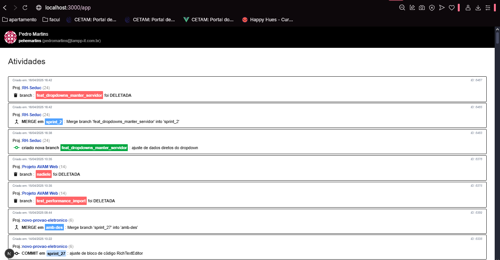
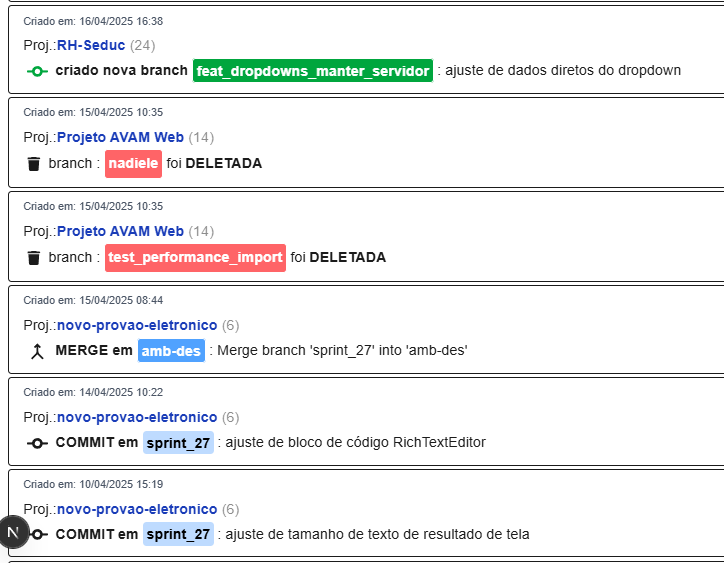

# MY TASK COMMITEDS
app that get my events(tasks) and list events for a expecific user gitlab.

## REQUIREMENTS:
- [x] I can take my activities from GitLab 
- [x] I can expecific type of actions (delete branchs, merge, commits e etc)
- [ ] and generate reports that are easier to understand.(to show for other my acitivities)
- [ ] get commit messages and undestands how task type and integrate relations. Get messages and get type of task (feat,fix,config,doc etc..) [just like gitflow commit messages](https://dev.to/mochafreddo/mastering-git-commit-message-types-and-git-flow-branch-naming-1lbb)
- [ ] filter events (by type, show only commits etc..)

## GITLAB
for connect you need :

GITLAB_URL='your_gitlab_url'
GITLAB_PRIVATE_KEY='your_gitlab_private_key'

[LINK GITLAB API DOCUMENTATION](
    https://docs.gitlab.com/api/rest/authentication/
)
#### list gitlab events:

#### list gitlab events (exp):

